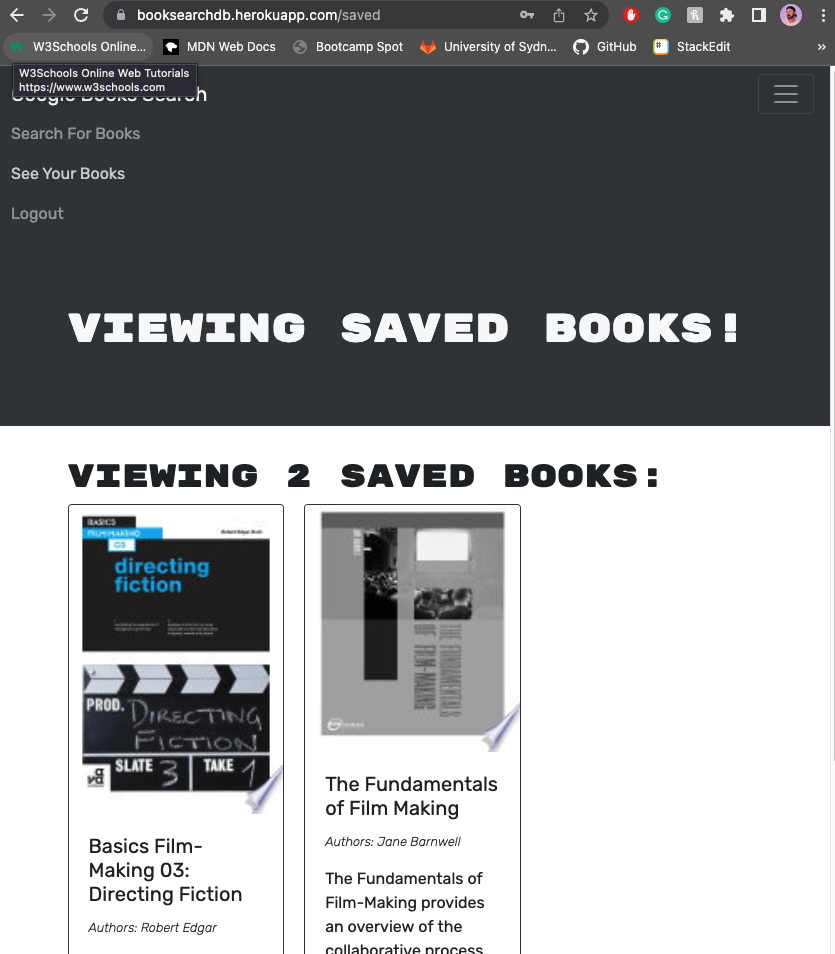

# Homework week 21 - Full Stack MERN book search application

Link: https://booksearchdb.herokuapp.com/saved 
Repo: https://github.com/Brento20/book_search 

## Table of Contents
[Project Description](#project-description)

[File Structure](#file-structure)

[Usage](#file-structure)

[Future Development](#future-development)

  

## Project Description

REvamp is a web application designed to help empower people to repair, restore and improve the items in our lives that society has told us have become disposable.

Our users can see DIY projects by category that give them inspiration for their own life as well as contributing DIY instructions.

Developed in collaboration with:

Miguel Afable, Mona Mahmoud and Brenton Weaver.

 

## File Structure

### MVC Model-View-Controller
   

## Deployment via Visual Studio
### Preliminary NPM Install
    - At the root level run "NPM install"
        - To run the application locally, run "NMP RUN DEVELOP"
### Online Deployment
    - Create accounts on Heroku and Atlas/mongoDB
    - Create a cluster using Atlas and create a connection with a username and password.
    - Create a heroku application and share the database username and password as a config var in your heroku application. 
    - Git push application to the heroku repository.

   
## Usage

Upon running the application, you are able to sign in using a JWS authenticated session, call the google books API and save results from this API in a MongoDB.

## Deployed application images

## Future Development

1. Social media integration: sharing, liking, and commenting. 
2. Indexing and PDF creation. 
3. Advertisement opportunities.
